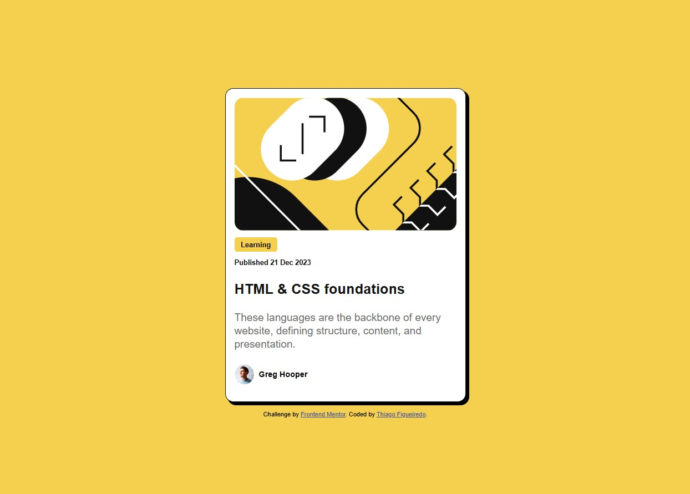

# Frontend Mentor - Blog preview card solution

This is a solution to the [Blog preview card challenge on Frontend Mentor](https://www.frontendmentor.io/challenges/blog-preview-card-ckPaj01IcS). Frontend Mentor challenges help you improve your coding skills by building realistic projects. 

## Table of contents

- [Overview](#overview)
  - [The challenge](#the-challenge)
  - [Screenshot](#screenshot)
  - [Links](#links)
- [My process](#my-process)
  - [Built with](#built-with)
  - [What I learned](#what-i-learned)
- [Author](#author)

## Overview

### The challenge

Users should be able to:

- See hover and focus states for all interactive elements on the page

### Screenshot




### Links

- Solution URL: [Add solution URL here](https://your-solution-url.com)
- Live Site URL: [Add live site URL here](https://thiagofigueiredoteixeira.github.io/blog_card_PEM/)

## My process

### Built with

- Semantic HTML5 markup
- CSS custom properties
- Flexbox
- Responsive Layout


### What I learned

One more time I pratice responsive layout. I learned more about "CLAMP" on CSS

```css
/*CAIXA PRINCIPAL*/
    .conteiner_principal{
      padding: 1em;
      margin: 0;
      width: clamp(250px, 80vw, 400px);
      height: auto;
      background-color: hsl(0, 0%, 100%);
      display: flex;
      flex-direction: column;
      border-radius: 15px;
      box-shadow: 5px 5px 0 1px;
      border: 0.1em solid hsl(0, 0%, 7%);
    }
```


## Author

- Website - [Thiago Figueiredo](https://github.com/ThiagoFigueiredoTeixeira)
- Frontend Mentor - [@yourusername](https://www.frontendmentor.io/profile/yourusername)


